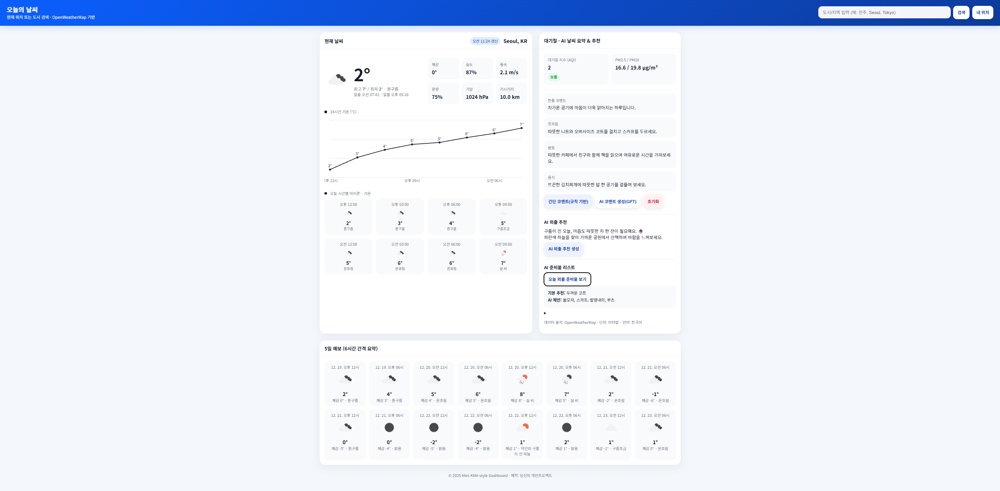

# Web_Application_Project

Node.js 기반 날씨 정보 웹 응용 서비스로,  
OpenWeatherMap API와 AI 기능을 활용하여 **날씨 정보를 해석하고 행동까지 추천하는 웹 서비스**입니다.  
단순한 기온·강수 정보 제공을 넘어,  
오늘의 날씨에 맞는 **옷차림, 활동, 음식, 외출 준비물**까지 안내하는 것을 목표로 합니다.

---

## 🖼️ 서비스 실행 화면

아래 이미지는 본 프로젝트의 실제 실행 화면으로,  
현재 날씨 정보, 시간별 기온 그래프, 대기질 정보 및 AI 기반 추천 기능을 확인할 수 있습니다.



---

## 📌 프로젝트 개요

- **프로젝트명**: Web_Application_Project  
- **프로젝트 유형**: 개인 프로젝트  
- **개발 목적**
  - 날씨 데이터를 단순 조회가 아닌 *의사결정 보조 정보*로 제공
  - 외부 API 연동 및 데이터 가공을 통한 실무형 웹 서비스 구현
  - AI(GPT) 기반 추천 기능을 실제 웹 서비스에 적용
- **개발 환경**: Node.js 기반 웹 애플리케이션

---

## 🛠️ 기술 스택

- **Frontend**
  - HTML5
  - CSS3
  - JavaScript (Vanilla JS)
- **Backend**
  - Node.js
  - Express
- **API**
  - OpenWeatherMap API (현재 날씨, 예보, 대기질)
- **AI**
  - GPT API (날씨 요약 및 추천 생성)
  - 규칙 기반 추천 로직 병행
- **기타**
  - Geolocation API (현재 위치 기반 날씨 조회)
  - Canvas API (24시간 기온 그래프 시각화)

---

## ✨ 주요 기능

### 1️⃣ 날씨 정보 조회
- 도시 검색 및 현재 위치 기반 날씨 조회
- 현재 기온, 체감 온도, 습도, 풍속, 기압, 가시거리 제공
- 대기질 지수(AQI), PM2.5 / PM10 정보 제공

### 2️⃣ 시간별 · 예보 시각화
- 24시간 기온 변화 **선형 그래프** 제공
- 오늘 시간별 날씨 아이콘 및 기온 (4×2 그리드 UI)
- 5일 예보 요약 정보 제공

### 3️⃣ 정확한 최고 · 최저 기온 계산
- API 기본 값이 아닌 **시간별 예보 데이터를 직접 분석**
- 실제 24시간 기준 최고·최저 기온 산출로 정보 신뢰도 향상

### 4️⃣ AI 날씨 요약 및 추천
- 한줄 날씨 코멘트 제공
- 오늘의 옷차림 추천
- 추천 활동 및 음식 제안
- 외출 시 준비물 리스트 제공
- GPT 호출 실패 시 규칙 기반 추천으로 자동 대체

---

## 🧠 서비스 특징

- **사용자 중심 설계**
  - 숫자 위주의 날씨 정보 → 행동 중심 정보로 변환
- **AI + 규칙 기반 하이브리드 구조**
  - 안정성과 확장성 확보
- **가독성 높은 UI**
  - 카드형 레이아웃과 그래프 기반 시각화
- **실생활 활용성 강화**
  - 사용자의 일상 의사결정을 직접적으로 지원하는 서비스

---

## 📂 프로젝트 구조

```plaintext
Web_Application_Project
 ┣ 📷 Main.png
 ┣ 📜 README.md
 ┣ 📜 weather.html
 ┣ 📜 server.js
 ┣ 📜 package.json
 ┗ 📜 package-lock.json
